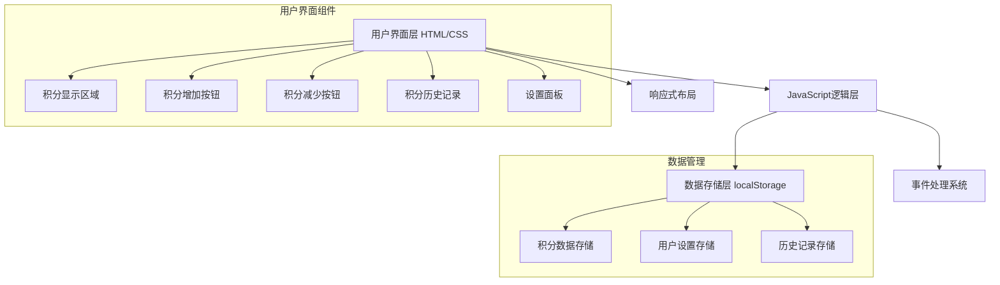
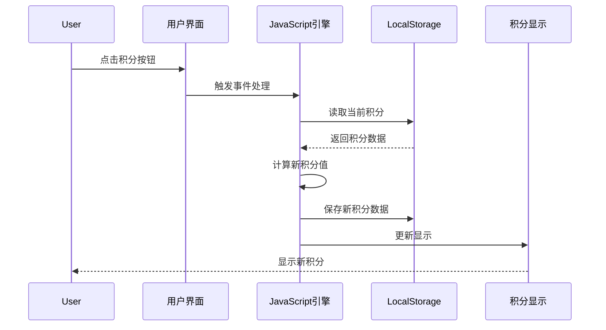

# 积分系统架构设计

## 系统概述

本系统是为孩子设计的积分展示和管理工具，采用纯前端架构，数据存储在浏览器本地。

## 整体架构



## 数据流图



## 组件架构

### 1. 核心组件

| 组件名称 | 功能描述 | 实现方式 |
|---------|---------|---------|
| 积分显示组件 | 显示当前积分和状态 | HTML + CSS + JavaScript |
| 积分操作组件 | 增加/减少积分的按钮和逻辑 | 事件监听 + DOM操作 |
| 数据存储组件 | 积分数据的本地存储管理 | localStorage API |
| 历史记录组件 | 显示积分变更历史 | 数组操作 + DOM渲染 |
| 响应式布局 | 适配不同屏幕尺寸 | CSS媒体查询 |

### 2. 数据结构设计

```javascript
// 主要数据结构
const pointsData = {
    currentPoints: 0,        // 当前积分
    totalEarned: 0,          // 总获得积分
    totalSpent: 0,           // 总消费积分
    lastUpdated: null,       // 最后更新时间
    history: [               // 积分历史记录
        {
            id: 1,
            type: 'earned',  // earned/spent
            amount: 10,
            reason: '完成作业',
            timestamp: '2025-12-14T02:15:00Z'
        }
    ],
    settings: {              // 用户设置
        childName: '小明',
        currency: '积分',
        notifications: true
    }
};
```

### 3. 功能模块

#### 3.1 积分管理模块
- **增加积分**: 支持自定义积分数量和原因
- **减少积分**: 支持自定义扣除数量和原因
- **批量操作**: 支持一次性添加/扣除多个积分项
- **撤销功能**: 允许撤销最近的积分操作

#### 3.2 历史记录模块
- **操作记录**: 记录每次积分变更的详细信息
- **筛选功能**: 按日期、操作类型筛选记录
- **数据导出**: 支持导出历史数据
- **统计信息**: 显示积分趋势和统计图表

#### 3.3 用户界面模块
- **主显示区**: 大字体显示当前积分
- **操作按钮**: 直观的大按钮设计
- **设置面板**: 儿童姓名、积分单位等设置
- **成就展示**: 显示里程碑和成就徽章

### 4. 技术栈选择

| 技术 | 选择 | 原因 |
|------|------|------|
| HTML5 | 必需 | 页面结构基础 |
| CSS3 | 必需 | 样式和响应式布局 |
| Vanilla JavaScript | 必需 | 无需外部依赖，轻量级 |
| LocalStorage | 必需 | 本地数据持久化 |
| CSS Grid/Flexbox | 推荐 | 响应式布局 |
| CSS动画 | 可选 | 提升用户体验 |

### 5. 安全性考虑

- **数据验证**: 所有输入数据都需要验证和清理
- **操作限制**: 积分操作需要确认，防止误操作
- **数据备份**: 定期提示用户备份重要数据
- **访问控制**: 简单的密码保护（可选）

### 6. 性能优化

- **懒加载**: 历史记录分页加载
- **防抖处理**: 按钮连续点击防护
- **数据压缩**: 优化存储数据结构
- **缓存策略**: 合理使用浏览器缓存

### 7. 可访问性

- **键盘导航**: 支持Tab键导航
- **屏幕阅读器**: 适当的ARIA标签
- **色彩对比**: 确保足够的对比度
- **字体大小**: 支持字体缩放

## 部署方案

- **单文件部署**: 所有功能集成在单个HTML文件中
- **离线运行**: 无需网络连接即可使用
- **跨平台**: 支持所有现代浏览器
- **便携性**: 可通过USB设备在不同设备间传输