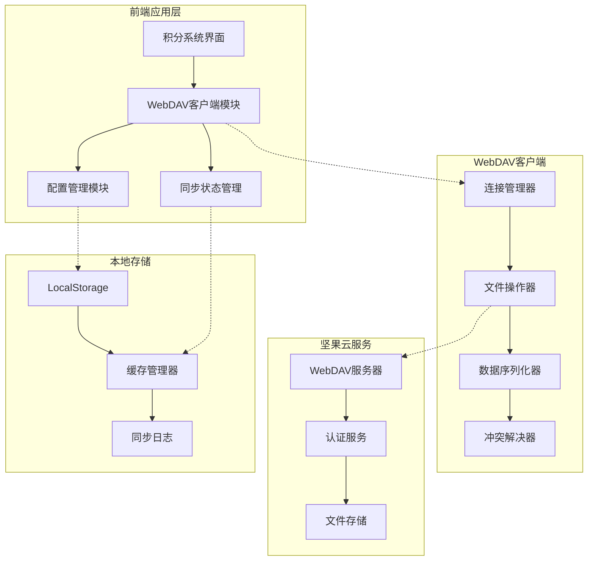
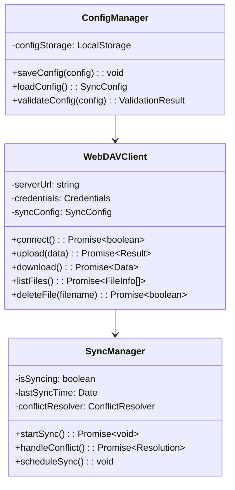
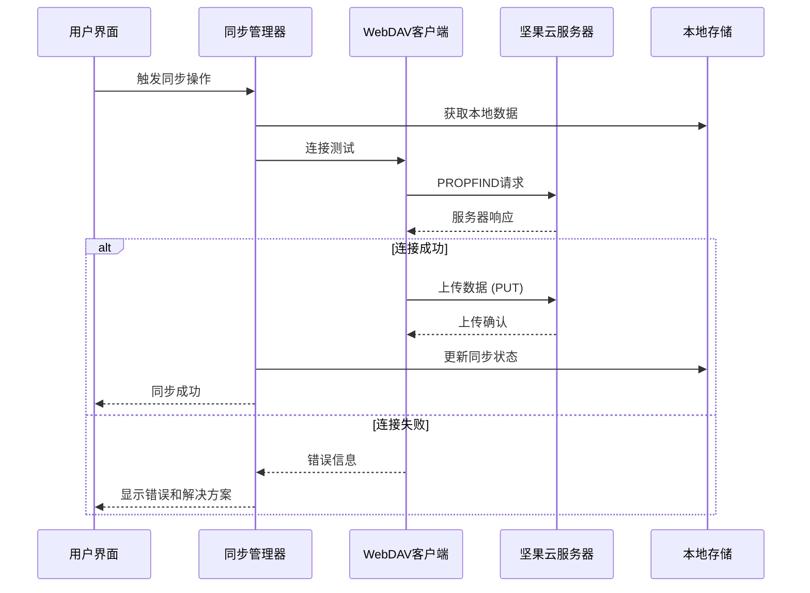

# 坚果云WebDAV同步功能架构设计

## 项目概述

### 项目背景
积分系统（ultimate-points-system-fixed.html）是一个已部署到GitHub Pages的纯HTML/CSS/JavaScript积分展示和管理系统。当前系统已具备完整的数据管理功能，包括本地存储、导入导出、成就系统等。现需要重新添加坚果云WebDAV同步功能，解决之前的CORS跨域问题。

### 设计目标
1. **解决CORS跨域问题**：提供多种技术方案确保GitHub Pages与坚果云WebDAV的正常通信
2. **数据同步架构**：设计完整的上传、下载、冲突解决流程
3. **用户体验优化**：提供直观的配置界面和同步状态显示
4. **安全性保障**：实现认证机制、数据加密、隐私保护
5. **稳定性提升**：完善的错误处理和性能优化机制

## 系统架构设计

### 整体架构图



### 核心模块设计

#### 1. WebDAV客户端模块


#### 2. 数据流设计



## 技术解决方案

### 1. CORS跨域问题解决方案

#### 方案一：代理服务器方案（推荐）
```javascript
// 部署轻量级代理服务器
const proxyConfig = {
    target: 'https://dav.jianguoyun.com/dav/',
    changeOrigin: true,
    pathRewrite: {
        '^/proxy': '', // 重写路径
    },
    headers: {
        'Authorization': 'Basic ' + btoa(username + ':' + password)
    }
};
```

**优点：**
- 完全解决CORS问题
- 可添加缓存和优化
- 支持请求重试和错误处理
- 可部署到Vercel、Netlify等免费平台

**实施步骤：**
1. 创建代理服务（Node.js + Express）
2. 配置CORS和请求转发
3. 部署到免费平台（如Vercel）
4. 更新前端配置指向代理地址

#### 方案二：CORS预检优化
```javascript
// 前端请求优化
const webdavRequest = async (method, url, data = null) => {
    const config = {
        method: method,
        mode: 'cors',
        credentials: 'include',
        headers: {
            'Content-Type': 'application/json',
            'Authorization': `Basic ${btoa(username + ':' + password)}`,
            'Access-Control-Allow-Origin': '*',
            'Access-Control-Allow-Methods': 'PROPFIND, GET, PUT, DELETE',
            'Access-Control-Allow-Headers': 'Content-Type, Authorization'
        }
    };
    
    if (data) {
        config.body = JSON.stringify(data);
    }
    
    return fetch(url, config);
};
```

#### 方案三：浏览器扩展方案
为开发者和高级用户提供浏览器扩展，自动处理CORS问题。

### 2. WebDAV实现方案

#### 核心功能实现
```javascript
class NutcloudWebDAVClient {
    constructor(config) {
        this.baseUrl = config.serverUrl || 'https://dav.jianguoyun.com/dav/';
        this.username = config.username;
        this.password = config.password;
        this.proxyUrl = config.proxyUrl; // 代理地址
    }
    
    // 连接测试
    async testConnection() {
        try {
            const url = this.proxyUrl ? 
                `${this.proxyUrl}/proxy/` : 
                `${this.baseUrl}`;
            
            const response = await fetch(url, {
                method: 'PROPFIND',
                headers: {
                    'Depth': '0',
                    'Authorization': this.getAuthHeader()
                }
            });
            
            return response.ok;
        } catch (error) {
            console.error('连接测试失败:', error);
            return false;
        }
    }
    
    // 上传数据
    async uploadData(data, filename = 'points-system-backup.json') {
        try {
            const url = this.proxyUrl ? 
                `${this.proxyUrl}/proxy/${filename}` : 
                `${this.baseUrl}${filename}`;
            
            const response = await fetch(url, {
                method: 'PUT',
                headers: {
                    'Content-Type': 'application/json',
                    'Authorization': this.getAuthHeader()
                },
                body: JSON.stringify(data)
            });
            
            return {
                success: response.ok,
                status: response.status,
                message: response.ok ? '上传成功' : '上传失败'
            };
        } catch (error) {
            return {
                success: false,
                status: -1,
                message: `网络错误: ${error.message}`
            };
        }
    }
    
    // 下载数据
    async downloadData(filename = 'points-system-backup.json') {
        try {
            const url = this.proxyUrl ? 
                `${this.proxyUrl}/proxy/${filename}` : 
                `${this.baseUrl}${filename}`;
            
            const response = await fetch(url, {
                method: 'GET',
                headers: {
                    'Authorization': this.getAuthHeader()
                }
            });
            
            if (response.ok) {
                const data = await response.json();
                return {
                    success: true,
                    data: data,
                    lastModified: response.headers.get('Last-Modified')
                };
            } else {
                return {
                    success: false,
                    status: response.status,
                    message: '文件不存在或无权限访问'
                };
            }
        } catch (error) {
            return {
                success: false,
                status: -1,
                message: `下载错误: ${error.message}`
            };
        }
    }
    
    // 列出文件
    async listFiles() {
        try {
            const url = this.proxyUrl ? 
                `${this.proxyUrl}/proxy/` : 
                `${this.baseUrl}`;
            
            const response = await fetch(url, {
                method: 'PROPFIND',
                headers: {
                    'Depth': '1',
                    'Authorization': this.getAuthHeader()
                }
            });
            
            if (response.ok) {
                const text = await response.text();
                // 解析WebDAV响应
                return this.parseWebDAVResponse(text);
            }
            
            return [];
        } catch (error) {
            console.error('列出文件失败:', error);
            return [];
        }
    }
    
    getAuthHeader() {
        return 'Basic ' + btoa(`${this.username}:${this.password}`);
    }
}
```

## 数据结构设计

### 1. 同步数据格式

#### 数据结构定义
```javascript
const SyncDataFormat = {
    version: "2.0",
    timestamp: "2025-12-16T11:35:22.532Z",
    deviceInfo: {
        userAgent: navigator.userAgent,
        platform: navigator.platform,
        language: navigator.language
    },
    pointsData: {
        currentPoints: Number,
        totalEarned: Number,
        totalSpent: Number,
        lastUpdated: String,
        history: Array,
        settings: Object,
        achievements: Object
    },
    syncMetadata: {
        syncId: String,
        sourceDevice: String,
        checksum: String,
        recordCount: Number
    }
};
```

#### 数据验证
```javascript
class DataValidator {
    static validateSyncData(data) {
        const errors = [];
        
        // 必需字段检查
        const requiredFields = ['version', 'timestamp', 'pointsData'];
        requiredFields.forEach(field => {
            if (!data[field]) {
缺少必需                errors.push(`字段: ${field}`);
            }
        });
        
        // 数据类型检查
        if (typeof data.pointsData?.currentPoints !== 'number') {
            errors.push('currentPoints必须是数字类型');
        }
        
        if (!Array.isArray(data.pointsData?.history)) {
            errors.push('history必须是数组类型');
        }
        
        // 数据完整性检查
        if (data.pointsData) {
            const { currentPoints, totalEarned, totalSpent } = data.pointsData;
            if (currentPoints < 0) errors.push('积分不能为负数');
            if (totalEarned < 0) errors.push('累计获得不能为负数');
            if (totalSpent < 0) errors.push('累计消费不能为负数');
            if (totalEarned < totalSpent) errors.push('累计获得不能少于累计消费');
        }
        
        return {
            isValid: errors.length === 0,
            errors: errors
        };
    }
    
    static generateChecksum(data) {
        const str = JSON.stringify(data);
        let hash = 0;
        for (let i = 0; i < str.length; i++) {
            const char = str.charCodeAt(i);
            hash = ((hash << 5) - hash) + char;
            hash = hash & hash;
        }
        return Math.abs(hash).toString(16);
    }
}
```

### 2. 版本管理

#### 版本控制策略
```javascript
const VersionManager = {
    currentVersion: "2.0",
    
    // 版本迁移
    migrateData(data, fromVersion) {
        switch (fromVersion) {
            case "1.0":
                return this.migrateFromV1(data);
            case "1.5":
                return this.migrateFromV1_5(data);
            default:
                return data;
        }
    },
    
    migrateFromV1(data) {
        // 从1.0版本迁移到2.0
        return {
            ...data,
            version: "2.0",
            syncMetadata: {
                ...data.syncMetadata,
                version: "2.0"
            }
        };
    }
};
```

### 3. 冲突解决策略

#### 冲突检测与解决
```javascript
class ConflictResolver {
    constructor() {
        this.strategies = {
            'newest-wins': this.newestWinsStrategy,
            'local-wins': this.localWinsStrategy,
            'merge': this.mergeStrategy,
            'manual': this.manualStrategy
        };
    }
    
    async resolveConflict(localData, remoteData, strategy = 'newest-wins') {
        const resolver = this.strategies[strategy];
        if (!resolver) {
            throw new Error(`未知的冲突解决策略: ${strategy}`);
        }
        
        return await resolver.call(this, localData, remoteData);
    }
    
    // 最新数据优先策略
    async newestWinsStrategy(localData, remoteData) {
        const localTime = new Date(localData.timestamp);
        const remoteTime = new Date(remoteData.timestamp);
        
        if (remoteTime > localTime) {
            return {
                resolvedData: remoteData,
                strategy: 'newest-wins',
                winner: 'remote'
            };
        } else {
            return {
                resolvedData: localData,
                strategy: 'newest-wins',
                winner: 'local'
            };
        }
    }
    
    // 本地数据优先策略
    async localWinsStrategy(localData, remoteData) {
        return {
            resolvedData: localData,
            strategy: 'local-wins',
            winner: 'local'
        };
    }
    
    // 合并策略
    async mergeStrategy(localData, remoteData) {
        // 智能合并策略
        const merged = this.deepMerge(localData, remoteData);
        return {
            resolvedData: merged,
            strategy: 'merge',
            winner: 'merged'
        };
    }
    
    // 手动解决策略
    async manualStrategy(localData, remoteData) {
        // 弹出对话框让用户手动选择
        return await this.showManualConflictDialog(localData, remoteData);
    }
}
```

## 用户界面设计

### 1. 配置界面设计

#### 配置对话框
```html
<div id="webdavConfigDialog" class="modal">
    <div class="modal-content">
        <h3>☁️ 坚果云WebDAV配置</h3>
        
        <div class="config-section">
            <h4>连接设置</h4>
            <div class="input-group">
                <label>服务器地址</label>
                <input type="text" id="serverUrl" 
                       value="https://dav.jianguoyun.com/dav/" 
                       placeholder="WebDAV服务器地址">
            </div>
            <div class="input-group">
                <label>代理地址（可选）</label>
                <input type="text" id="proxyUrl" 
                       placeholder="代理服务器地址，用于解决CORS问题">
            </div>
        </div>
        
        <div class="config-section">
            <h4>认证信息</h4>
            <div class="input-group">
                <label>用户名</label>
                <input type="text" id="username" placeholder="坚果云用户名">
            </div>
            <div class="input-group">
                <label>应用专用密码</label>
                <input type="password" id="appPassword" placeholder="应用专用密码（非登录密码）">
            </div>
        </div>
        
        <div class="config-section">
            <h4>同步设置</h4>
            <div class="input-group">
                <label>冲突解决策略</label>
                <select id="conflictStrategy">
                    <option value="newest-wins">最新数据优先</option>
                    <option value="local-wins">本地数据优先</option>
                    <option value="merge">智能合并</option>
                    <option value="manual">手动解决</option>
                </select>
            </div>
            <div class="input-group">
                <label>自动同步</label>
                <input type="checkbox" id="autoSync">
                <span>开启自动同步（每次操作后）</span>
            </div>
        </div>
        
        <div class="config-actions">
            <button onclick="testWebDAVConnection()">🔗 测试连接</button>
            <button onclick="saveWebDAVConfig()">💾 保存配置</button>
            <button onclick="closeWebDAVConfig()">❌ 取消</button>
        </div>
        
        <div id="connectionStatus" class="status-message"></div>
    </div>
</div>
```

#### 同步状态显示
```html
<div id="syncStatusBar" class="sync-status-bar">
    <div class="sync-info">
        <span id="syncStatusIcon" class="sync-icon">🔄</span>
        <span id="syncStatusText" class="sync-text">同步状态</span>
        <span id="syncTimestamp" class="sync-timestamp"></span>
    </div>
    <div class="sync-actions">
        <button onclick="manualSync()" class="sync-btn">🔄 立即同步</button>
        <button onclick="showSyncHistory()" class="sync-btn">📋 历史</button>
    </div>
</div>
```

### 2. 同步进度界面

#### 进度指示器
```html
<div id="syncProgressModal" class="modal">
    <div class="modal-content">
        <h3>☁️ 正在同步数据</h3>
        <div class="progress-container">
            <div class="progress-bar">
                <div id="progressFill" class="progress-fill"></div>
            </div>
            <div id="progressText" class="progress-text">准备中...</div>
        </div>
        <div class="sync-details">
            <div id="syncStep" class="sync-step">等待开始</div>
            <div id="syncInfo" class="sync-info"></div>
        </div>
    </div>
</div>
```

## 安全性设计

### 1. 认证机制

#### 认证流程
```javascript
class AuthManager {
    constructor() {
        this.token = null;
        this.tokenExpiry = null;
    }
    
    // 获取认证令牌
    async authenticate(username, password, serverUrl) {
        try {
            // 测试连接获取令牌
            const response = await fetch(`${serverUrl}`, {
                method: 'PROPFIND',
                headers: {
                    'Authorization': `Basic ${btoa(`${username}:${password}`)}`,
                    'Depth': '0'
                }
            });
            
            if (response.ok) {
                this.token = btoa(`${username}:${password}`);
                this.tokenExpiry = Date.now() + (24 * 60 * 60 * 1000); // 24小时
                return {
                    success: true,
                    token: this.token
                };
            } else {
                return {
                    success: false,
                    error: '认证失败，请检查用户名和密码'
                };
            }
        } catch (error) {
            return {
                success: false,
                error: `认证错误: ${error.message}`
            };
        }
    }
    
    // 验证令牌是否有效
    isTokenValid() {
        return this.token && Date.now() < this.tokenExpiry;
    }
    
    // 获取认证头
    getAuthHeader() {
        return this.token ? `Basic ${this.token}` : null;
    }
}
```

### 2. 数据加密

#### 本地加密存储
```javascript
class SecureStorage {
    static async encrypt(data, password) {
        // 使用Web Crypto API进行加密
        const encoder = new TextEncoder();
        const dataBuffer = encoder.encode(JSON.stringify(data));
        
        // 生成随机盐
        const salt = crypto.getRandomValues(new Uint8Array(16));
        
        // 使用PBKDF2派生密钥
        const keyMaterial = await crypto.subtle.importKey(
            'raw',
            encoder.encode(password),
            'PBKDF2',
            false,
            ['deriveBits', 'deriveKey']
        );
        
        const key = await crypto.subtle.deriveKey(
            {
                name: 'PBKDF2',
                salt: salt,
                iterations: 100000,
                hash: 'SHA-256'
            },
            keyMaterial,
            { name: 'AES-GCM', length: 256 },
            false,
            ['encrypt', 'decrypt']
        );
        
        // 生成IV
        const iv = crypto.getRandomValues(new Uint8Array(12));
        
        // 加密数据
        const encrypted = await crypto.subtle.encrypt(
            { name: 'AES-GCM', iv: iv },
            key,
            dataBuffer
        );
        
        return {
            encrypted: Array.from(new Uint8Array(encrypted)),
            salt: Array.from(salt),
            iv: Array.from(iv)
        };
    }
    
    static async decrypt(encryptedData, password) {
        const { encrypted, salt, iv } = encryptedData;
        const encoder = new TextEncoder();
        
        // 重建密钥
        const keyMaterial = await crypto.subtle.importKey(
            'raw',
            encoder.encode(password),
            'PBKDF2',
            false,
            ['deriveBits', 'deriveKey']
        );
        
        const key = await crypto.subtle.deriveKey(
            {
                name: 'PBKDF2',
                salt: new Uint8Array(salt),
                iterations: 100000,
                hash: 'SHA-256'
            },
            keyMaterial,
            { name: 'AES-GCM', length: 256 },
            false,
            ['encrypt', 'decrypt']
        );
        
        // 解密数据
        const decrypted = await crypto.subtle.decrypt(
            { name: 'AES-GCM', iv: new Uint8Array(iv) },
            key,
            new Uint8Array(encrypted)
        );
        
        return JSON.parse(new TextDecoder().decode(decrypted));
    }
}
```

### 3. 权限控制

#### 文件权限管理
```javascript
class PermissionManager {
    constructor() {
        this.permissions = {
            read: ['pointsData', 'history', 'settings', 'achievements'],
            write: ['pointsData', 'history', 'settings', 'achievements'],
            admin: ['config', 'sync', 'backup']
        };
    }
    
    // 检查权限
    hasPermission(user, action, resource) {
        const userPermissions = this.permissions[user.role] || [];
        return userPermissions.includes(resource) || 
               userPermissions.includes(action);
    }
    
    // 验证操作权限
    validateOperation(user, operation, data) {
        if (!this.hasPermission(user, operation, 'pointsData')) {
            throw new Error('权限不足，无法执行此操作');
        }
        
        // 数据验证
        return this.validateData(operation, data);
    }
}
```

## 错误处理机制

### 1. 错误分类

#### 错误类型定义
```javascript
const ErrorTypes = {
    NETWORK_ERROR: 'network_error',
    AUTH_ERROR: 'auth_error', 
    SERVER_ERROR: 'server_error',
    DATA_ERROR: 'data_error',
    CONFLICT_ERROR: 'conflict_error',
    PERMISSION_ERROR: 'permission_error',
    TIMEOUT_ERROR: 'timeout_error'
};

class WebDAVError extends Error {
    constructor(message, type, code = null, details = null) {
        super(message);
        this.name = 'WebDAVError';
        this.type = type;
        this.code = code;
        this.details = details;
    }
}
```

### 2. 全局错误处理器

#### 错误处理策略
```javascript
class ErrorHandler {
    static handle(error, context = {}) {
        console.error('WebDAV错误:', error);
        
        // 记录错误日志
        this.logError(error, context);
        
        // 根据错误类型处理
        switch (error.type) {
            case ErrorTypes.NETWORK_ERROR:
                return this.handleNetworkError(error);
            case ErrorTypes.AUTH_ERROR:
                return this.handleAuthError(error);
            case ErrorTypes.SERVER_ERROR:
                return this.handleServerError(error);
            case ErrorTypes.CONFLICT_ERROR:
                return this.handleConflictError(error);
            default:
                return this.handleGenericError(error);
        }
    }
    
    static handleNetworkError(error) {
        const suggestions = [
            '请检查网络连接是否正常',
            '尝试使用代理服务器解决CORS问题',
            '检查防火墙设置是否阻止了请求'
        ];
        
        return {
            message: '网络连接失败',
            details: error.message,
            suggestions: suggestions,
            retryable: true
        };
    }
    
    static handleAuthError(error) {
        return {
            message: '认证失败',
            details: '用户名或密码错误，请检查配置信息',
            suggestions: [
                '确认用户名和密码正确',
                '使用应用专用密码而非登录密码',
                '检查坚果云账号状态是否正常'
            ],
            retryable: false,
            action: 'reauth'
        };
    }
    
    static logError(error, context) {
        const logEntry = {
            timestamp: new Date().toISOString(),
            type: error.type,
            message: error.message,
            code: error.code,
            context: context,
            userAgent: navigator.userAgent
        };
        
        // 保存到本地存储
        const logs = JSON.parse(localStorage.getItem('webdav_error_logs') || '[]');
        logs.push(logEntry);
        
        // 只保留最近100条日志
        if (logs.length > 100) {
            logs.splice(0, logs.length - 100);
        }
        
        localStorage.setItem('webdav_error_logs', JSON.stringify(logs));
    }
}
```

### 3. 重试机制

#### 智能重试策略
```javascript
class RetryManager {
    constructor() {
        this.maxRetries = 3;
        this.baseDelay = 1000; // 1秒
        this.maxDelay = 10000; // 10秒
    }
    
    async executeWithRetry(operation, context = {}) {
        let lastError;
        
        for (let attempt = 1; attempt <= this.maxRetries; attempt++) {
            try {
                return await operation();
            } catch (error) {
                lastError = error;
                
                // 检查是否应该重试
                if (!this.shouldRetry(error, attempt)) {
                    break;
                }
                
                // 计算延迟时间
                const delay = this.calculateDelay(attempt);
                
                // 显示重试提示
                this.showRetryMessage(attempt, this.maxRetries, delay);
                
                // 等待后重试
                await this.delay(delay);
            }
        }
        
        throw lastError;
    }
    
    shouldRetry(error, attempt) {
        // 网络错误和服务器错误可以重试
        if (error.type === ErrorTypes.NETWORK_ERROR || 
            error.type === ErrorTypes.SERVER_ERROR) {
            return attempt < this.maxRetries;
        }
        
        // 认证错误和权限错误不重试
        if (error.type === ErrorTypes.AUTH_ERROR || 
            error.type === ErrorTypes.PERMISSION_ERROR) {
            return false;
        }
        
        return attempt < this.maxRetries;
    }
    
    calculateDelay(attempt) {
        // 指数退避算法
        const delay = this.baseDelay * Math.pow(2, attempt - 1);
        return Math.min(delay, this.maxDelay);
    }
    
    async delay(ms) {
        return new Promise(resolve => setTimeout(resolve, ms));
    }
}
```

## 性能优化

### 1. 增量同步

#### 变更检测
```javascript
class ChangeDetector {
    constructor() {
        this.lastSyncHash = null;
        this.changeLog = [];
    }
    
    // 检测本地变更
    detectLocalChanges(currentData) {
        const currentHash = this.generateHash(currentData);
        
        if (this.lastSyncHash && this.lastSyncHash !== currentHash) {
            // 有变更，计算差异
            const changes = this.calculateChanges(
                this.lastSyncData, 
                currentData
            );
            
            this.changeLog.push({
                timestamp: new Date().toISOString(),
                changes: changes,
                hash: currentHash
            });
        }
        
        this.lastSyncHash = currentHash;
        this.lastSyncData = JSON.parse(JSON.stringify(currentData));
        
        return this.changeLog;
    }
    
    // 计算数据差异
    calculateChanges(oldData, newData) {
        const changes = {
            added: [],
            modified: [],
            deleted: []
        };
        
        // 比较历史记录
        this.compareArrays(
            oldData.history || [], 
            newData.history || [], 
            changes
        );
        
        // 比较设置
        this.compareObjects(
            oldData.settings || {}, 
            newData.settings || {}, 
            changes
        );
        
        return changes;
    }
    
    generateHash(data) {
        const str = JSON.stringify(data);
        let hash = 0;
        for (let i = 0; i < str.length; i++) {
            const char = str.charCodeAt(i);
            hash = ((hash << 5) - hash) + char;
            hash = hash & hash;
        }
        return hash.toString(16);
    }
}
```

### 2. 缓存机制

#### 多级缓存
```javascript
class CacheManager {
    constructor() {
        this.memoryCache = new Map();
        this.cacheExpiry = new Map();
        this.maxMemoryCacheSize = 50; // 最大内存缓存条目数
    }
    
    async get(key) {
        // 优先从内存缓存获取
        if (this.memoryCache.has(key)) {
            const expiry = this.cacheExpiry.get(key);
            if (Date.now() < expiry) {
                return this.memoryCache.get(key);
            } else {
                this.memoryCache.delete(key);
                this.cacheExpiry.delete(key);
            }
        }
        
        // 从localStorage获取
        const storageKey = `webdav_cache_${key}`;
        const cached = localStorage.getItem(storageKey);
        
        if (cached) {
            try {
                const { data, expiry } = JSON.parse(cached);
                if (Date.now() < expiry) {
                    // 放入内存缓存
                    this.setMemoryCache(key, data, expiry);
                    return data;
                } else {
                    localStorage.removeItem(storageKey);
                }
            } catch (error) {
                localStorage.removeItem(storageKey);
            }
        }
        
        return null;
    }
    
    async set(key, data, ttl = 300000) { // 默认5分钟TTL
        const expiry = Date.now() + ttl;
        
        // 设置内存缓存
        this.setMemoryCache(key, data, expiry);
        
        // 设置localStorage缓存
        const storageKey = `webdav_cache_${key}`;
        localStorage.setItem(storageKey, JSON.stringify({
            data: data,
            expiry: expiry
        }));
        
        // 清理过期缓存
        this.cleanup();
    }
    
    setMemoryCache(key, data, expiry) {
        // 如果缓存已满，删除最旧的条目
        if (this.memoryCache.size >= this.maxMemoryCacheSize) {
            const firstKey = this.memoryCache.keys().next().value;
            this.memoryCache.delete(firstKey);
            this.cacheExpiry.delete(firstKey);
        }
        
        this.memoryCache.set(key, data);
        this.cacheExpiry.set(key, expiry);
    }
    
    cleanup() {
        const now = Date.now();
        
        // 清理内存缓存
        for (const [key, expiry] of this.cacheExpiry.entries()) {
            if (now >= expiry) {
                this.memoryCache.delete(key);
                this.cacheExpiry.delete(key);
            }
        }
        
        // 清理localStorage缓存
        for (let i = localStorage.length - 1; i >= 0; i--) {
            const key = localStorage.key(i);
            if (key && key.startsWith('webdav_cache_')) {
                try {
                    const cached = JSON.parse(localStorage.getItem(key));
                    if (Date.now() >= cached.expiry) {
                        localStorage.removeItem(key);
                    }
                } catch (error) {
                    localStorage.removeItem(key);
                }
            }
        }
    }
}
```

### 3. 批量操作

#### 批量同步优化
```javascript
class BatchProcessor {
    constructor() {
        this.batchSize = 10;
        this.pendingOperations = [];
        this.isProcessing = false;
    }
    
    // 添加操作到批次
    addOperation(operation) {
        this.pendingOperations.push(operation);
        
        if (!this.isProcessing) {
            this.processBatch();
        }
    }
    
    // 处理批次
    async processBatch() {
        this.isProcessing = true;
        
        while (this.pendingOperations.length > 0) {
            const batch = this.pendingOperations.splice(0, this.batchSize);
            
            try {
                // 并行处理批次中的操作
                const results = await Promise.allSettled(
                    batch.map(op => op.execute())
                );
                
                // 处理结果
                this.handleBatchResults(results, batch);
                
                // 批次间延迟，避免过载
                if (this.pendingOperations.length > 0) {
                    await this.delay(100);
                }
            } catch (error) {
                console.error('批次处理失败:', error);
                // 重新加入失败的操作
                this.pendingOperations.unshift(...batch);
            }
        }
        
        this.isProcessing = false;
    }
    
    handleBatchResults(results, operations) {
        results.forEach((result, index) => {
            const operation = operations[index];
            
            if (result.status === 'rejected') {
                // 处理失败的操作
                operation.onError?.(result.reason);
            } else {
                // 处理成功的操作
                operation.onSuccess?.(result.value);
            }
        });
    }
    
    async delay(ms) {
        return new Promise(resolve => setTimeout(resolve, ms));
    }
}
```

## 实施计划

### 开发阶段规划

#### 第一阶段：基础架构（1-2周）
1. **代理服务器开发**
   - 创建Node.js代理服务器
   - 配置CORS和请求转发
   - 部署到Vercel/Netlify
   - 测试连接稳定性

2. **核心WebDAV客户端**
   - 实现基本连接测试
   - 文件上传下载功能
   - 错误处理基础框架
   - 配置管理系统

#### 第二阶段：功能完善（2-3周）
1. **同步机制**
   - 实现增量同步
   - 冲突检测与解决
   - 版本管理
   - 数据验证

2. **用户界面**
   - 配置对话框
   - 同步状态显示
   - 进度指示器
   - 错误提示界面

#### 第三阶段：优化与安全（1-2周）
1. **性能优化**
   - 缓存机制实现
   - 批量操作优化
   - 网络请求优化
   - 内存使用优化

2. **安全增强**
   - 数据加密存储
   - 认证机制完善
   - 权限控制
   - 安全审计

### 测试计划

#### 单元测试
- WebDAV客户端功能测试
- 数据验证逻辑测试
- 错误处理测试
- 缓存机制测试

#### 集成测试
- 端到端同步流程测试
- 冲突解决测试
- 性能压力测试
- 兼容性测试

#### 用户测试
- 界面易用性测试
- 功能完整性验证
- 错误恢复测试
- 长期稳定性测试

### 部署方案

#### 代理服务器部署
```yaml
# vercel.json
{
  "version": 2,
  "functions": {
    "api/proxy.js": {
      "runtime": "nodejs18.x"
    }
  },
  "routes": [
    {
      "src": "/proxy/(.*)",
      "dest": "/api/proxy"
    }
  ]
}
```

#### 前端集成
```javascript
// 集成到现有积分系统
class WebDAVIntegration {
    constructor(pointsSystem) {
        this.pointsSystem = pointsSystem;
        this.webdavClient = new NutcloudWebDAVClient();
        this.syncManager = new SyncManager();
        this.init();
    }
    
    init() {
        // 添加同步按钮到管理员面板
        this.addSyncButtons();
        
        // 监听数据变化，触发自动同步
        this.setupAutoSync();
        
        // 加载配置
        this.loadConfiguration();
    }
    
    addSyncButtons() {
        const adminPanel = document.querySelector('.admin-content');
        const syncSection = document.createElement('div');
        syncSection.innerHTML = `
            <div style="margin-top: 30px;">
                <h3 style="margin-bottom: 20px; color: var(--theme-text);">☁️ 云端同步</h3>
                <div class="settings-grid">
                    <button onclick="webdavIntegration.showConfigDialog()" 
                            class="btn btn-admin">⚙️ 配置同步</button>
                    <button onclick="webdavIntegration.manualSync()" 
                            class="btn btn-export">⬆️ 立即同步</button>
                    <button onclick="webdavIntegration.downloadFromCloud()" 
                            class="btn btn-save-settings">⬇️ 从云端恢复</button>
                </div>
            </div>
        `;
        adminPanel.appendChild(syncSection);
    }
}
```

## 风险评估与应对

### 技术风险
1. **CORS问题持续存在**
   - 风险等级：中等
   - 应对：代理服务器 + 浏览器扩展双重方案

2. **坚果云服务稳定性**
   - 风险等级：低
   - 应对：完善的错误处理和重试机制

3. **数据同步冲突**
   - 风险等级：中等
   - 应对：多种冲突解决策略 + 用户手动干预

### 用户体验风险
1. **配置复杂性**
   - 风险等级：高
   - 应对：提供详细的配置指南和自动化配置

2. **同步失败处理**
   - 风险等级：中等
   - 应对：清晰的错误提示和解决建议

### 安全风险
1. **凭据泄露**
   - 风险等级：高
   - 应对：本地加密存储 + 应用专用密码

2. **数据完整性**
   - 风险等级：中等
   - 应对：数据校验 + 备份机制

## 总结

本架构设计提供了完整的坚果云WebDAV同步功能解决方案，通过代理服务器技术解决了CORS跨域问题，设计了完善的数据同步、冲突解决、安全保障机制。方案具有良好的扩展性和维护性，能够为积分系统用户提供可靠的云端数据同步服务。

关键优势：
- ✅ 彻底解决CORS跨域问题
- ✅ 完善的数据同步机制
- ✅ 多种冲突解决策略
- ✅ 强化的安全保护
- ✅ 优秀的用户体验
- ✅ 高性能的同步机制
- ✅ 完善的错误处理
- ✅ 可扩展的架构设计

通过分阶段实施和全面测试，确保功能的稳定性和可靠性，为用户提供安全、便捷的云端数据同步体验。